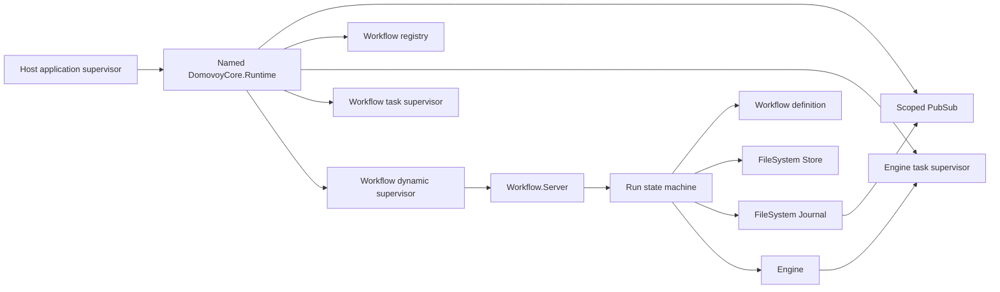
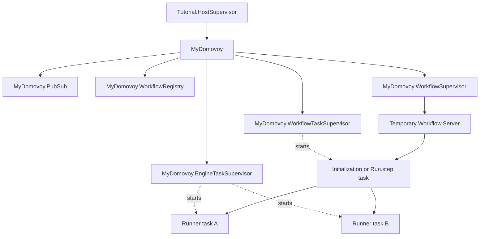
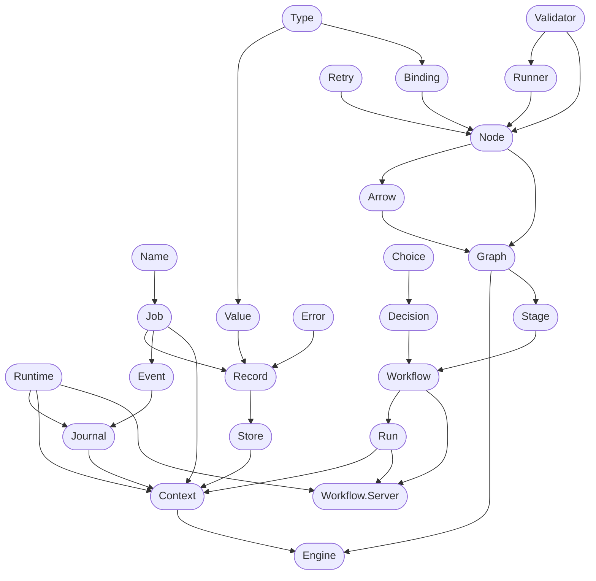
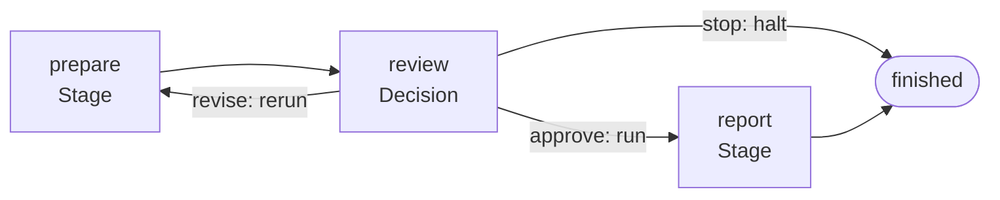
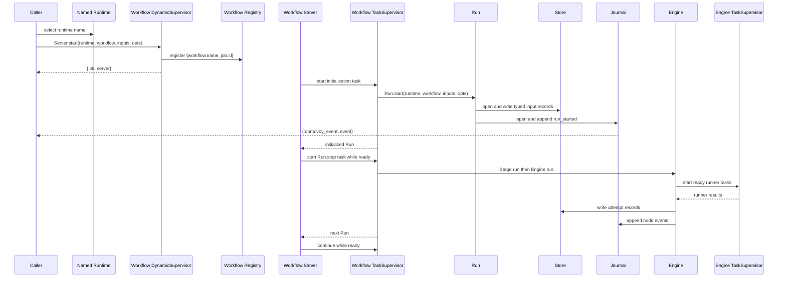

# Core Concepts

This guide explains the production DomovoyCore API and builds a small typed
workflow that can be controlled directly or through OTP supervision.

## Architecture

DomovoyCore is a library application. It has no `Application` callback and does
not start a global process tree. The caller adds one or more named
`DomovoyCore.Runtime` children to its own supervisor, much like a Finch client,
and passes the selected runtime name to APIs that need process infrastructure.

The static definitions (`Workflow`, `Stage`, `Decision`, `Graph`, and `Node`)
are ordinary structs. `Run` is the state machine for one execution.
`Workflow.Server` optionally owns a Run and drives it in supervised tasks.



## Setup

The examples use these aliases:

```elixir
alias DomovoyCore.Arrow
alias DomovoyCore.Binding
alias DomovoyCore.Choice
alias DomovoyCore.Context
alias DomovoyCore.Decision
alias DomovoyCore.Engine
alias DomovoyCore.Engine.Order
alias DomovoyCore.Error
alias DomovoyCore.Event
alias DomovoyCore.Graph
alias DomovoyCore.Job
alias DomovoyCore.Journal
alias DomovoyCore.Name
alias DomovoyCore.Node
alias DomovoyCore.Record
alias DomovoyCore.Retry
alias DomovoyCore.Run
alias DomovoyCore.Stage
alias DomovoyCore.Store
alias DomovoyCore.Type
alias DomovoyCore.Validator
alias DomovoyCore.Value
alias DomovoyCore.Workflow
alias DomovoyCore.Workflow.Server

alias DomovoyCore.Journal.FileSystem, as: FileSystemJournal
alias DomovoyCore.Store.FileSystem, as: FileSystemStore
```

Use a disposable root for examples that write records and events:

```elixir
example_root = Path.join(System.tmp_dir!(), "domovoy_core_example")
File.rm_rf!(example_root)
File.mkdir_p!(example_root)
```

## Runtime

`DomovoyCore.Runtime` is caller-supervised process infrastructure. Add it to
the host application's children rather than starting DomovoyCore as a separate
application:

```elixir
children = [
  {DomovoyCore.Runtime, name: MyDomovoy}
]

Supervisor.start_link(children,
  strategy: :one_for_one,
  name: Tutorial.HostSupervisor
)
```

The required `:name` is both the runtime supervisor's registered name and the
runtime reference passed to `Run`, `Journal`, and `Workflow.Server` operations.
The runtime options are:

| Option | Default | Purpose |
| --- | ---: | --- |
| `:name` | required | Atom that names and selects the runtime. |
| `:workflow_task_max_children` | `100` | Maximum concurrent workflow initialization and step tasks. |
| `:workflow_server_max_children` | `500` | Maximum active workflow server children. |

Multiple names create fully isolated runtime instances in one VM:

```elixir
children = [
  {DomovoyCore.Runtime, name: PrimaryDomovoy},
  {DomovoyCore.Runtime,
   name: BatchDomovoy,
   workflow_task_max_children: 20,
   workflow_server_max_children: 50}
]
```

A runtime contains no records or journal history itself. Those are owned by
the workflow's adapters. The runtime provides PubSub, registration, task
supervision, and workflow process supervision.



Workflow servers use `restart: :temporary`. A process restart without replay
would not contain the last committed Run, so durable recovery is explicit via
`Server.resume/4`.

## Core Struct Relationships

The following diagram shows the main definitions and runtime values. An arrow
means the item at the tail constructs, contains, or supplies the item at the
head.



## Tutorial Modules

These modules are self-contained and are reused throughout the guide.

### Validator

`Tutorial.PositiveCount` demonstrates a `DomovoyCore.Validator`. Validators
receive an Ecto changeset and the current Context, add rule errors, and return
the changeset. They must not put input values or secrets in errors.

```elixir
defmodule Tutorial.PositiveCount do
  @behaviour DomovoyCore.Validator

  @impl DomovoyCore.Validator
  def validate(changeset, %DomovoyCore.Context{}) do
    Ecto.Changeset.validate_number(changeset, :count, greater_than: 0)
  end
end
```

### Runners

`use DomovoyCore.Runner` defines an embedded Ecto input schema. A runner gets
the generated input struct and Context, then returns `{:ok, raw}`,
`{:ok, raw, metadata}`, or `{:error, reason}`. The Engine casts a successful raw
result through the Node's output type.

```elixir
defmodule Tutorial.DoubleRunner do
  use DomovoyCore.Runner, retry: [max_attempts: 2]

  input do
    field :count, DomovoyCore.Type.Integer
  end

  required [:count]
  validators [Tutorial.PositiveCount]

  @impl DomovoyCore.Runner
  def run(%Input{count: count}, %DomovoyCore.Context{}) do
    {:ok, count * 2}
  end
end

defmodule Tutorial.IncrementRunner do
  use DomovoyCore.Runner

  input do
    field :value, DomovoyCore.Type.Integer
  end

  required [:value]

  @impl DomovoyCore.Runner
  def run(%Input{value: value}, %DomovoyCore.Context{}) do
    {:ok, value + 1}
  end
end

defmodule Tutorial.PassRunner do
  use DomovoyCore.Runner

  input do
    field :value, DomovoyCore.Type.Integer, default: 0
  end

  @impl DomovoyCore.Runner
  def run(%Input{value: value}, %DomovoyCore.Context{}) do
    {:ok, value}
  end
end
```

Runner-level validators run first, followed by `node.validators`. The Engine
calls the runner only when the final changeset is valid. Runner retry defaults
can be replaced field by field by Node options.

### Automated Decider

A `DomovoyCore.Decider` can answer from stored data. Its callback receives a
Decision, Context, and the options declared on that Decision.

```elixir
defmodule Tutorial.ThresholdDecider do
  @behaviour DomovoyCore.Decider

  alias DomovoyCore.{Context, Record, Store, Value}

  @impl DomovoyCore.Decider
  def decide(_decision, %Context{} = context, opts) do
    threshold = Keyword.get(opts, :threshold, 10)

    case Store.latest(
           context.store,
           "increment",
           context.job.generation
         ) do
      {:ok, %Record{result: %Value{value: value}}}
      when value >= threshold ->
        {:ok, "approve"}

      {:ok, %Record{}} ->
        {:ok, "revise", %{"count" => threshold}}

      _other ->
        {:error, :increment_missing}
    end
  end
end
```

A decider may return `:await`, `{:ok, choice_name}`,
`{:ok, choice_name, inputs}`, or `{:error, reason}`. Choice inputs are raw
values; Run casts them using the chosen Choice's declarations.

## Compose The Tutorial Workflow

### Nodes And Bindings

A Node declares one runner, its output Type, and the runner's inputs. `args`
contains typed literals. `bind` maps a runner field to `{source, type}` and is
converted to a `Binding`. `after` creates order without moving data.

```elixir
double =
  Node.new(%{
    name: "double",
    runner: Tutorial.DoubleRunner,
    type: Type.Integer,
    bind: %{count: {"count", Type.Integer}},
    retry: [max_attempts: 3, backoff_ms: 100, timeout_ms: 5_000]
  })

increment =
  Node.new(%{
    name: "increment",
    runner: Tutorial.IncrementRunner,
    type: Type.Integer,
    bind: %{value: {"double", Type.Integer}}
  })

audit =
  Node.new(%{
    name: "audit",
    runner: Tutorial.PassRunner,
    type: Type.Integer,
    args: %{value: {0, Type.Integer}},
    after: ["increment"],
    store?: false
  })
```

The complete output of the source supplies a binding. A binding does not
project a nested field. If a consumer needs one field, another node must emit
that field as its complete value.

`store?: false` keeps records produced by that Node out of the Store, although
the Engine still checks for an existing exact-generation hit before execution.

### Graph And Order

`Graph.new/1` validates duplicate names, dependency sources, binding types,
external input type conflicts, control sources, and cycles.

```elixir
prepare_graph = Graph.new([double, increment, audit])
prepare_graph.inputs
# => %{"count" => DomovoyCore.Type.Integer}

Order.order(prepare_graph)
# => {:ok, ["double", "increment", "audit"]}

Order.waves(prepare_graph)
# => {:ok, [["double"], ["increment"], ["audit"]]}
```

An Arrow joins two names. Graph arrows are derived from both data bindings and
control-only `after` dependencies:

```elixir
Arrow.new("double", "increment")
# => %DomovoyCore.Arrow{from: "double", to: "increment"}

prepare_graph.arrows
# => arrows sorted by source and destination
```

`Order.waves/1` is useful for inspection, but the Engine does not execute fixed
batches. It starts a Node when all of that Node's predecessors have completed
and a task slot is free.


### Stage

A Stage wraps one Graph and points to one next workflow vertex or `nil`. It has
no output or binding layer of its own; Node records carry values between
stages.

```elixir
prepare_stage =
  Stage.new(%{
    name: "prepare",
    graph: prepare_graph,
    next: "review"
  })

report_stage =
  Stage.new(%{
    name: "report",
    graph: Graph.new()
  })

Stage.inputs(prepare_stage)
# => %{"count" => DomovoyCore.Type.Integer}
```

`Stage.run/3` puts the stage name into Context and delegates to
`Engine.run/4`. A Stage with `next: nil` finishes the workflow.

### Choice, Decision, And Person

A Choice names one route and any typed inputs that route accepts:

```elixir
approve =
  Choice.new(%{
    name: "approve",
    description: "Continue to the report.",
    target: {:run, "report"}
  })

revise =
  Choice.new(%{
    name: "revise",
    description: "Supply a new count and compute again.",
    target: {:rerun, "prepare"},
    inputs: %{"count" => Type.Integer}
  })

stop =
  Choice.new(%{
    name: "stop",
    description: "End the workflow now.",
    target: :halt
  })
```

`{:run, vertex}` preserves the generation. `{:rerun, stage}` increments it,
and `:halt` finishes immediately.

A Decision offers Choices and delegates its answer to a decider. The default
is `DomovoyCore.Decider.Person`, whose `decide/3` returns `:await`:

```elixir
review_decision =
  Decision.new(%{
    name: "review",
    prompt: "Accept the computed value?",
    choices: [approve, revise, stop]
  })

review_decision.decider
# => DomovoyCore.Decider.Person

Decision.choice_names(review_decision)
# => ["approve", "revise", "stop"]

Decision.target(review_decision, "revise")
# => {:rerun, "prepare"}

Decision.answer(review_decision, "approve")
# => %DomovoyCore.Value{type: DomovoyCore.Type.Choice, ...}
```

To automate the same branch, set a custom decider:

```elixir
automated_review =
  Decision.new(%{
    name: "review",
    prompt: "Accept the computed value?",
    choices: [approve, revise, stop],
    decider: {Tutorial.ThresholdDecider, threshold: 10}
  })
```

### Workflow

A Workflow combines Stages and Decisions. Its arrows are control flow only;
typed data moves through records in the Store.

```elixir
tutorial_workflow =
  Workflow.new!(%{
    name: "tutorial",
    vertices: %{
      "prepare" => prepare_stage,
      "review" => review_decision,
      "report" => report_stage
    },
    start: "prepare",
    inputs: %{
      "count" => %{type: Type.Integer},
      "note" => %{type: Type.String, default: "No note."}
    },
    store: {FileSystemStore, root: example_root},
    journal: {FileSystemJournal, root: example_root}
  })
```

`Workflow.new!/1` validates names, vertices, targets, Stage graphs, adapters,
name collisions, and whether graph inputs can be supplied along each reachable
workflow path. `Workflow.new/1` returns the Workflow or a `%DomovoyCore.Error{}`
instead of raising.

When adapters are omitted, the defaults are
`DomovoyCore.Store.FileSystem` and `DomovoyCore.Journal.FileSystem`, rooted at
`.domovoy/runs`. A bare adapter module means `{module, []}`.



## Name

`DomovoyCore.Name` protects values that become path segments. Run ids,
workflow names, Node names, and binding sources contain one or more letters,
digits, underscores, or hyphens.

```elixir
{Name.valid?("run-30"), Name.valid?("../run-30"), Name.regex()}
# => {true, false, ~r/^[A-Za-z0-9_-]+$/}

Name.check!("run-30")
# => "run-30"

random_name = Name.random()
{String.length(random_name), Name.valid?(random_name)}
# => {16, true}
```

`check!/1` raises for invalid names. `random/0` returns 16 lowercase hexadecimal
characters.

## Type And Primitive Types

`DomovoyCore.Type` is both a behaviour and an `Ecto.Type` convention. A custom
type defines `type/0` and `cast/2`. The latter receives the raw value and value
metadata, then returns `{:ok, value}`, `{:ok, value, metadata}`, `:error`, or
`{:error, keyword}`.

```elixir
defmodule Tutorial.Point do
  use DomovoyCore.Type

  @impl Ecto.Type
  def type, do: :map

  @impl DomovoyCore.Type
  def cast({x, y} = point, _metadata)
      when is_integer(x) and is_integer(y),
      do: {:ok, point}

  def cast(_raw, _metadata), do: :error
end

Value.cast({1, 2}, Tutorial.Point)
# => {:ok, %DomovoyCore.Value{type: Tutorial.Point, value: {1, 2}, ...}}
```

The included types are:

| Type | Accepted value |
| --- | --- |
| `DomovoyCore.Type.String` | Any binary, including an empty string. |
| `DomovoyCore.Type.Integer` | An integer, not a numeric string. |
| `DomovoyCore.Type.Boolean` | `true` or `false`. |
| `DomovoyCore.Type.Map` | A non-struct map. |
| `DomovoyCore.Type.Any` | Any term, subject to document serialization when persisted. |
| `DomovoyCore.Type.Directory` | A path to an existing directory; the value is expanded. |
| `DomovoyCore.Type.Choice` | A valid Choice stored as a Decision answer. |

The default `dump/1` uses `Type.document/1`, which produces JSON-compatible
terms and stringifies atom keys. A custom type whose values contain tuples,
structs, or atom keys that must round-trip should implement suitable `dump/1`
and `load/1` functions. `Type.type?/1` checks whether a loaded module implements
the behaviour.

## Value

`DomovoyCore.Value` is the typed unit that moves through the system. It holds
the raw value, the Type module that accepted it, and opaque metadata with
string keys.

```elixir
value = Value.cast!(42, Type.Integer, %{"source" => "tutorial"})
# => %DomovoyCore.Value{
#      value: 42,
#      type: DomovoyCore.Type.Integer,
#      metadata: %{"source" => "tutorial"}
#    }

Value.cast("42", Type.Integer)
# => {:error, %DomovoyCore.Error{type: :cast_error, ...}}
```

`Value.cast/3` is the constructor that always invokes the Type. `cast!/3`
raises on refusal. `dump/1` produces a versioned document and `load/1` checks
the version and Type module before rebuilding the Value.

## Error

`DomovoyCore.Error` is the common error struct:

```elixir
Error.new(%{
  type: :temporary_failure,
  reason: %{service: "example"},
  retryable?: true
})
# => %DomovoyCore.Error{type: :temporary_failure, ...}
```

Callers should match `error.type`; `Error.message/1` is for human-readable
logs. `reason` explains the failure, `retryable?` controls Engine retries, and
`metadata` is opaque to the core. Core errors follow a redaction rule: they
carry names, types, paths, and validation rules, not resolved values or input
structs. `Error.dump/1` and `load/1` provide a JSON-safe journal form.

## Job

`DomovoyCore.Job` identifies a run. Its stable `id` is a Name, `generation`
counts workflow re-runs, `attempt` counts Node attempts, and `metadata` belongs
to the caller.

```elixir
job = Job.new("tutorial-1", %{"request_id" => "req-1"})
# => %DomovoyCore.Job{
#      id: "tutorial-1",
#      generation: 0,
#      attempt: 1,
#      metadata: %{"request_id" => "req-1"}
#    }

Job.next_generation(job)
# => %DomovoyCore.Job{generation: 1, attempt: 1, ...}

job |> Job.at_generation(2) |> Job.at_attempt(3)
# => %DomovoyCore.Job{generation: 2, attempt: 3, ...}
```

Context, Record, and Event carry the complete Job. Code should not reconstruct
it from `job.id`, because that would lose generation, attempt, and metadata.

## Record

A Record stores one Node attempt. Its key is
`{run_id, node, generation, attempt}`. An `:ok` Record contains a Value, an
`:error` Record contains an Error, and `:cancelled` or `:skipped` records have
no result.

```elixir
record =
  Record.new(%{
    job: job,
    node: "count",
    status: :ok,
    result: Value.cast!(5, Type.Integer)
  })

{Record.key(record), Record.ok?(record)}
# => {{"tutorial-1", "count", 0, 1}, true}
```

`started_at` and `finished_at` are populated for runner attempts and are `nil`
for workflow inputs. `dump/1` and `load/1` translate the complete Record to and
from a versioned document.

## Store And FileSystem

`DomovoyCore.Store` is the adapter facade for one run's records. The included
filesystem adapter writes one JSON file per Record under
`<root>/<workflow>/<run_id>/`.

```elixir
store_job = Job.new("store-example")

{:ok, store} =
  Store.open(
    FileSystemStore,
    store_job.id,
    workflow: "tutorial_store",
    root: example_root
  )

stored =
  Record.new(%{
    job: store_job,
    node: "count",
    status: :ok,
    result: Value.cast!(10, Type.Integer)
  })

:ok = Store.put(store, stored)
{:ok, ^stored} = Store.get(store, "count", 0)
{:ok, ^stored} = Store.latest(store, "count", 3)
{:ok, [^stored]} = Store.all(store)
```

`get/3` returns the successful Record with the highest attempt at exactly one
generation. `latest/3` may walk back to an earlier generation. Failed,
cancelled, and skipped records are retained but are never cache hits.
`runs/2` lists `%{workflow: workflow, run_id: run_id}` entries known below a
root.

```elixir
FileSystemStore.file_name(stored)
# => "count-g0-a1.json"

Store.runs(FileSystemStore, root: example_root)
# => {:ok, [%{workflow: "tutorial_store", run_id: "store-example"}]}
```

The default root is `.domovoy/runs`, expanded from the current working
directory. Set `root:` explicitly in applications that need a stable data
location.

## Event

An Event describes one state change. It contains the Job at that moment, a UTC
timestamp, a kind, a subject, a payload, and metadata.

```elixir
event =
  Event.new(%{
    job: store_job,
    at: ~U[2026-09-16 10:00:00Z],
    kind: :node_finished,
    subject: "double",
    payload: %{"hit" => false}
  })

event.kind
# => :node_finished
```

`Event.kinds/0` returns the lifecycle kinds in run order:

```elixir
Event.kinds()
# => [
#   :run_started,
#   :stage_started,
#   :node_started,
#   :node_finished,
#   :node_failed,
#   :node_retried,
#   :node_cancelled,
#   :node_skipped,
#   :stage_finished,
#   :stage_failed,
#   :decision_awaited,
#   :decided,
#   :run_halted,
#   :run_finished,
#   :run_failed
# ]
```

Like Values and Records, Events use versioned `dump/1` and `load/1` documents.

## Journal And FileSystem

`DomovoyCore.Journal` is the ordered, append-only Event history of one run.
Unlike Store opening, `Journal.open/4` takes the runtime first because appends
also broadcast through that runtime's PubSub.

```elixir
journal_job = Job.new("journal-example")

{:ok, journal} =
  Journal.open(
    MyDomovoy,
    FileSystemJournal,
    journal_job.id,
    workflow: "tutorial_journal",
    root: example_root
  )

:ok =
  Phoenix.PubSub.subscribe(
    DomovoyCore.Runtime.pubsub(MyDomovoy),
    Journal.topic("tutorial_journal", journal_job.id)
  )

journal_event =
  Event.new(%{
    job: journal_job,
    kind: :run_started,
    subject: "tutorial_journal"
  })

:ok = Journal.append(journal, journal_event)
{:ok, [^journal_event]} = Journal.events(journal)

receive do
  {:domovoy_event, %Event{kind: kind}} -> kind
end
# => :run_started
```

The filesystem journal appends one JSON line per Event to
`<root>/<workflow>/<run_id>/events.jsonl`. Adapter persistence happens before
the best-effort broadcast. `Journal.topic/2` returns the scoped topic
`"run:<workflow>:<run_id>"`.

Use `Server.subscribe/3` rather than addressing the runtime PubSub component
directly in normal workflow consumers.

## Context

Context identifies work in progress. It holds the Job, workflow, Stage, Node,
open Store, open Journal, selected Runtime, and opaque metadata.

```elixir
context = %Context{
  job: store_job,
  workflow: "tutorial_store",
  store: store,
  runtime: MyDomovoy
}

{context.job.id, context.stage, context.node, context.runtime}
# => {"store-example", nil, nil, MyDomovoy}
```

Run creates the base Context, Stage sets `stage`, and Engine sets `node` and an
attempt-specific Job before calling a runner or validator.

## Binding

A Binding names one complete value source and the Type expected by its
consumer. Consumers normally declare `{source, type}` tuples in `Node.bind`;
`Node.new/1` validates and converts them.

```elixir
binding = increment.bind.value
# => %DomovoyCore.Binding{
#      from: "double",
#      type: DomovoyCore.Type.Integer,
#      metadata: %{}
#    }
```

The source must be a Name. Dotted paths are not projections and are rejected.

## Retry

Retry holds `max_attempts`, fixed `backoff_ms`, and per-attempt `timeout_ms`.

```elixir
Retry.new([])
# => %DomovoyCore.Retry{
#      max_attempts: 1,
#      backoff_ms: 0,
#      timeout_ms: :infinity,
#      metadata: %{}
#    }

defaults = Retry.new(max_attempts: 3, backoff_ms: 100)
Retry.new(%{timeout_ms: 500}, defaults)
# => %DomovoyCore.Retry{
#      max_attempts: 3,
#      backoff_ms: 100,
#      timeout_ms: 500,
#      metadata: %{}
#    }
```

Only errors with `retryable?: true` retry. Timeouts and abnormal task exits are
retryable. Input resolution, validation, cast, and invalid-result failures are
not. Backoff consumes no runner task slot.

## Validator

A Validator adds checks to the runner changeset:

```elixir
changeset =
  Ecto.Changeset.cast(
    {%{}, %{count: :integer}},
    %{count: -1},
    [:count]
  )

checked =
  Tutorial.PositiveCount.validate(changeset, %Context{})

checked.valid?
# => false
```

The Engine runs runner validators before Node validators, applies the
changeset only after all checks, and returns an `:invalid_input` Error without
calling the runner when it is invalid.

## Runner

The Runner behaviour performs one Node's work. The DSL exposes `input`,
`required`, and `validators`; `use DomovoyCore.Runner` also accepts `retry:`
and `extra?:` options.

```elixir
changeset =
  DomovoyCore.Runner.changeset(
    Tutorial.DoubleRunner,
    %{"count" => 3}
  )

input = Ecto.Changeset.apply_changes(changeset)
Tutorial.DoubleRunner.run(input, %Context{})
# => {:ok, 6}
```

The Engine normalizes results as follows:

| Runner result | Engine behavior |
| --- | --- |
| `{:ok, raw}` | Cast `raw` through the Node output Type. |
| `{:ok, raw, metadata}` | Cast with Value metadata. |
| `{:error, %Error{}}` | Preserve that Error and its retry flag. |
| `{:error, reason}` | Build a retryable `:runner_failed` Error. |
| Any other result | Build a non-retryable `:invalid_runner_result` Error. |

Execution-time overrides can be passed as `runners: %{node_name => module}`.
An override must have a compatible typed input schema.

## Node

Node is the static declaration for a computation step. Its important fields
are:

| Field | Meaning |
| --- | --- |
| `name` | Stable Name used for records and dependencies. |
| `runner` | Typed Runner module. |
| `type` | Output Type. |
| `bind` | Runner fields supplied by complete values from named sources. |
| `args` | Runner fields supplied by typed literals. |
| `after` | Control-only predecessor names. |
| `validators` | Additional Validator modules. |
| `retry` | Per-field override of Runner retry defaults. |
| `store?` | Whether newly produced records are persisted. |

`Node.new/1` verifies required fields, input schema fields and types, binding
source names, retries, and conflicts between `bind` and `args`. Literal values
are cast during execution, not construction.

## Arrow

Arrow represents one dependency between two Node names or one control route
between two workflow vertices. Graph data arrows come from `bind`; graph
control arrows come from `after`; workflow arrows come from Stage and Choice
targets.

```elixir
arrows = [
  Arrow.new("a", "c"),
  Arrow.new("b", "c")
]

Arrow.predecessors(arrows)
# => %{"c" => ["a", "b"]}

Arrow.successors(arrows)
# => %{"a" => ["c"], "b" => ["c"]}
```

## Graph And Topological Order

Graph is a directed acyclic graph of Nodes. External binding sources appear in
`graph.inputs` rather than `nodes_by_name`. `Order.order/1` performs a stable
Kahn topological sort, while `Order.waves/1` groups Nodes whose graph
predecessors occur in earlier groups.

```elixir
shape_node = fn name, predecessors ->
  Node.new(%{
    name: name,
    runner: Tutorial.PassRunner,
    type: Type.Integer,
    args: %{value: {0, Type.Integer}},
    after: predecessors
  })
end

diamond =
  Graph.new([
    shape_node.("d", ["b", "c"]),
    shape_node.("b", ["a"]),
    shape_node.("c", ["a"]),
    shape_node.("a", [])
  ])

Order.waves(diamond)
# => {:ok, [["a"], ["b", "c"], ["d"]]}
```

For `N` Nodes and `E` Arrows, ordering uses `O(N + E)` time and memory. A cycle
returns a `:graph_has_cycle` Error naming the cycle and Nodes blocked behind it.

## Engine

Engine executes a Graph with readiness-driven scheduling. It resolves typed
inputs and runs validators in its caller process, then executes runners under
the selected Runtime's engine task supervisor.

```elixir
engine_job = Job.new("engine-example")

{:ok, engine_store} =
  Store.open(
    FileSystemStore,
    engine_job.id,
    workflow: "engine_tutorial",
    root: example_root
  )

{:ok, engine_journal} =
  Journal.open(
    MyDomovoy,
    FileSystemJournal,
    engine_job.id,
    workflow: "engine_tutorial",
    root: example_root
  )

engine_context = %Context{
  job: engine_job,
  workflow: "engine_tutorial",
  store: engine_store,
  journal: engine_journal,
  runtime: MyDomovoy
}

count = Value.cast!(20, Type.Integer)

{:ok, records} =
  Engine.run(
    prepare_graph,
    %{"count" => count},
    engine_context,
    max_concurrency: 2
  )

%Record{result: %Value{value: result}} = records["increment"]
result
# => 41
```

Before scheduling a Node, Engine checks the Store for an exact-generation hit.
A hit skips runner execution. On terminal failure, active and retry-waiting
Nodes become `:cancelled`, unstarted Nodes become `:skipped`, completed Nodes
remain `:ok`, and the result contains one final Record per graph Node.

## Run

Run is the state of one workflow execution. It holds a small cursor and status,
the Job, runtime reference, adapters, generation limit, and runner overrides;
Records and Events remain in the Store and Journal.

A Run has four statuses:

| Status | Meaning |
| --- | --- |
| `:ready` | The vertex under the cursor can run. |
| `:awaiting_decision` | A person's answer is required. |
| `:finished` | The final Stage completed or a Choice halted. |
| `:failed` | A Stage, decider, Store, Journal, or server step failed. |

### Start

Runtime is the first argument to `Run.start/4`:

```elixir
run =
  Run.start(
    MyDomovoy,
    tutorial_workflow,
    %{"count" => 5},
    job: Job.new("tutorial-run-1")
  )

{run.status, run.cursor, run.job.generation}
# => {:ready, "prepare", 0}
```

Start casts declared workflow inputs, supplies defaults, writes input Records,
opens the Store and Journal, fingerprints the inputs, and appends
`:run_started`. Options are `:job`, `:runners`, and `:max_generations` (default
`10`).

### Step

`Run.step/2` executes one vertex. `Run.run_to_decision/2` repeatedly steps
while the Run remains `:ready`, including through automated Decisions.

```elixir
run = Run.step(tutorial_workflow, run)
{run.status, run.cursor}
# => {:ready, "review"}

run = Run.run_to_decision(tutorial_workflow, run)
{run.status, run.cursor}
# => {:awaiting_decision, "review"}
```

### Decide

`Run.decide/4` validates a person's Choice and its raw inputs. Invalid answers
are soft errors: status and cursor remain unchanged so the caller can answer
again.

```elixir
refused = Run.decide(tutorial_workflow, run, "unknown", %{})
{refused.status, refused.error.type}
# => {:awaiting_decision, :choice_not_offered}

run =
  Run.decide(
    tutorial_workflow,
    run,
    "revise",
    %{"count" => 8}
  )

{run.status, run.cursor, run.job.generation}
# => {:ready, "prepare", 1}
```

The answer Record is written at the current generation. For a re-run, the Job
then advances and the Choice's inputs are written at the new generation before
`:decided` is appended. Older Records remain available.

### Replay

`Run.apply/2` is the pure event-folding transition. It performs no I/O and
starts no process:

```elixir
snapshot_job = Job.new("snapshot-1")

snapshot =
  Run.apply(
    %Run{job: snapshot_job},
    Event.new(%{
      job: snapshot_job,
      kind: :run_started,
      subject: "tutorial",
      payload: %{"cursor" => "prepare"}
    })
  )

{snapshot.workflow, snapshot.status, snapshot.cursor}
# => {"tutorial", :ready, "prepare"}
```

`Run.replay/4` takes runtime first, opens the workflow adapters, reads Events in
order, and folds them with `apply/2`:

```elixir
replayed =
  Run.replay(
    MyDomovoy,
    tutorial_workflow,
    "tutorial-run-1"
  )

{replayed.status, replayed.cursor, replayed.job.generation}
```

Pass `runners:` and `max_generations:` again during replay because they are run
configuration and are not persisted in Events.

## Workflow Server

`DomovoyCore.Workflow.Server` is an optional OTP owner for one active Run. It
registers by `{workflow.name, run_id}`, initializes and steps in bounded tasks,
and remains responsive while work runs. It does not replace Run validation,
persistence, or event folding.

| Concept | Kind | Responsibility |
| --- | --- | --- |
| Job | Struct | Stable run id plus generation, attempt, and caller metadata. |
| Run | Struct | Workflow cursor, status, adapters, and execution options. |
| Workflow.Server | Process | Owns and asynchronously drives one Run. |

### Start And Observe

Subscribe before starting so no Event is missed. Runtime is first for
`subscribe/3` and `start/4`:

```elixir
server_job = Job.new("server-tutorial-1")

:ok =
  Server.subscribe(
    MyDomovoy,
    tutorial_workflow.name,
    server_job.id
  )

{:ok, server} =
  Server.start(
    MyDomovoy,
    tutorial_workflow,
    %{"count" => 5},
    job: server_job
  )

receive do
  {:domovoy_event,
   %Event{
     kind: :decision_awaited,
     job: %Job{id: "server-tutorial-1"}
   }} ->
    :ok
after
  5_000 -> raise "workflow did not reach its decision"
end

view = Server.state(server)
{view.status, view.cursor, view.generation, Server.busy?(server)}
# => {:awaiting_decision, "review", 0, false}
```

During initialization, `state/1` returns `{:error, :starting}` and `busy?/1`
returns `true`. Thereafter the projected view contains `workflow`, `run_id`,
`status`, `cursor`, `generation`, and `error`, but no adapter handles.
`whereis/3` takes runtime first and looks up the owner.

### Answer

`Server.decide/3` runs in the server process. It returns `:run_busy` during
initialization, queueing, or an active step. A successful answer returns the
immediate post-decision view; later Stages continue in background tasks.

```elixir
{:ok, %{status: :ready, cursor: "report"}} =
  Server.decide(server, "approve", %{})

receive do
  {:domovoy_event,
   %Event{
     kind: :run_finished,
     job: %Job{id: "server-tutorial-1"}
   }} ->
    :ok
after
  5_000 -> raise "workflow did not finish"
end
```

Observe progress through `state/1`, `busy?/1`, scoped
`{:domovoy_event, event}` messages, and telemetry.

### Stop And Resume

`Server.stop/1` is idempotent. It fences stale step messages, cancels queued or
active work, stops linked runner tasks, and terminates the temporary server.
It cannot undo an external side effect already accepted by another system, so
runners that may be replayed should use idempotency keys.

```elixir
:ok = Server.stop(server)

{:ok, resumed} =
  Server.resume(
    MyDomovoy,
    tutorial_workflow,
    server_job.id
  )
```

`Server.resume/4` returns an existing live owner when present. Otherwise it
requires durable Store and Journal adapters, calls `Run.replay/4`, and starts a
new owner. A replayed `:ready` Run continues automatically. Supply runner
overrides and `max_generations` again for cold resume.

### Start Sequence



## Telemetry

`Workflow.Server` emits telemetry under the
`[:domovoy_core, :workflow, ...]` prefix. Span events have the usual `:start`,
`:stop`, and `:exception` suffixes:

| Prefix | Operation |
| --- | --- |
| `[:domovoy_core, :workflow, :start]` | Initialize a fresh Run. |
| `[:domovoy_core, :workflow, :resume]` | Replay and start a cold owner. |
| `[:domovoy_core, :workflow, :decide]` | Apply a person's answer. |
| `[:domovoy_core, :workflow, :drive]` | Execute one workflow vertex. |
| `[:domovoy_core, :workflow, :drive, :queued]` | Wait for workflow task capacity. |
| `[:domovoy_core, :workflow, :drive, :dequeued]` | Acquire workflow task capacity. |

Attach handlers to complete event names, for example:

```elixir
:telemetry.attach_many(
  "tutorial-workflows",
  [
    [:domovoy_core, :workflow, :start, :stop],
    [:domovoy_core, :workflow, :drive, :stop],
    [:domovoy_core, :workflow, :drive, :exception],
    [:domovoy_core, :workflow, :decide, :stop],
    [:domovoy_core, :workflow, :resume, :stop],
    [:domovoy_core, :workflow, :drive, :queued],
    [:domovoy_core, :workflow, :drive, :dequeued]
  ],
  fn event, measurements, metadata, _config ->
    IO.inspect({event, measurements, metadata})
  end,
  nil
)
```

Common metadata includes `workflow`, `run_id`, `generation`, and `cursor`.
Stop metadata also includes `outcome`. Drive metadata adds `vertex` and
`kind`, where kind is `:stage`, `:decision`, or `:unknown`.

## Run State

```mermaid
stateDiagram-v2
  [*] --> ready : Run.start(runtime, workflow, inputs)
  ready --> ready : Stage or automated Decision advances
  ready --> awaiting_decision : Person returns await
  ready --> finished : final Stage or automated halt
  ready --> failed : execution or persistence error
  awaiting_decision --> ready : decide with run target
  awaiting_decision --> ready : decide with rerun target; increment generation
  awaiting_decision --> finished : decide with halt target
  awaiting_decision --> awaiting_decision : invalid answer; soft error
  failed --> failed : terminal
  finished --> finished : terminal
```



## Summary

DomovoyCore separates typed values, executable Nodes, data-flow Graphs,
control-flow Workflows, durable records and events, and OTP process ownership.
The host owns named Runtime instances. Direct Run functions expose the state
machine, while Workflow.Server drives the same functions asynchronously.
Filesystem Store and Journal adapters make replay and cold resume durable, and
PubSub plus telemetry expose progress without putting adapter handles in the
server's public state.
